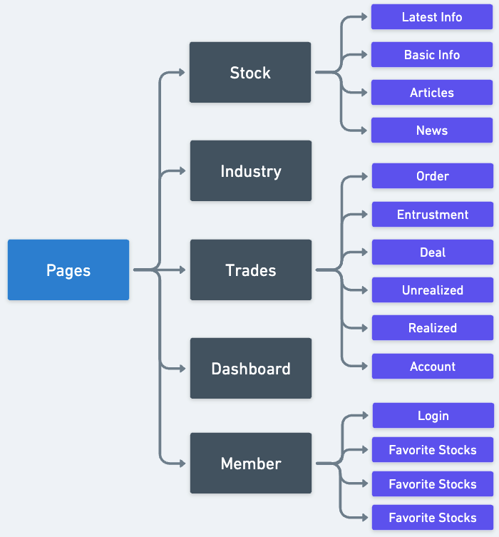
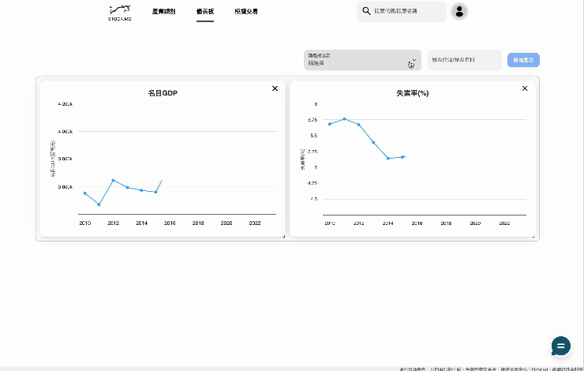
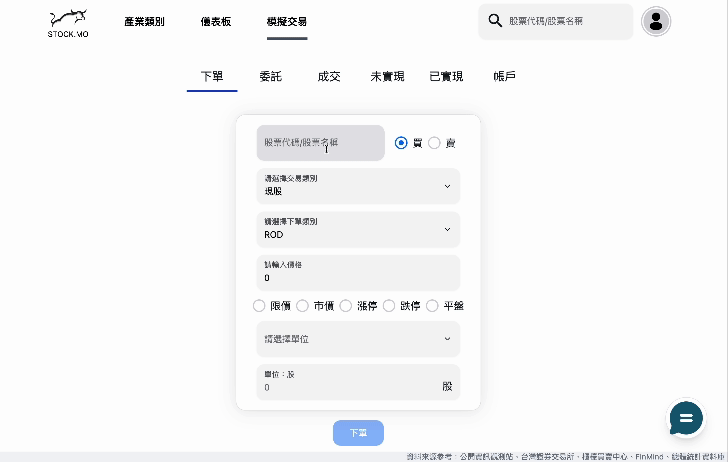
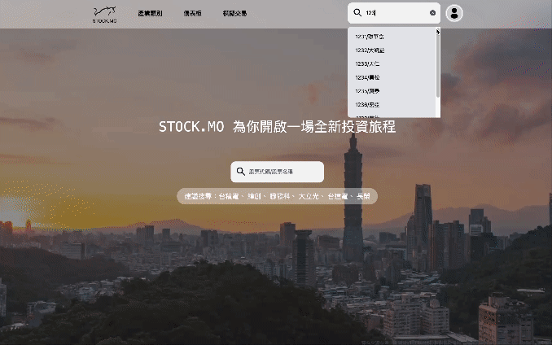

# STOCK.MO

[STOCK.MO](https://stockmo.web.app/) is a finance data integration website developed for the Taiwan Stock Exchange, featuring financial chart dashboards, chat rooms, and simulated trading.

## About STOCK.MO

1. Fetched financial data from third-party APIs offered by [FinMind](https://finmindtrade.com/), visualized the data using the `Highcharts`, and combined the charts into a dashboard with `React-Grid-Layout`, providing customized user experience

2. Integrated `Firebase Firestore` as the Back-End, including implementing `onSnapshot` for real-time data updates in the chat rooms

3. Implemented `Zustand` for global state management to maintain data consistency and predictability

4. Employed `Tailwind CSS` to achieve responsive web design

## Built with


## Libraries

- React Router
- React-Grid-Layout
- React-hook-form
- Zustand
- Highcharts
- NextUI
- TipTap

## File Structure

   

## Demo

1. Dashboard

   

2. Trade

   

3. Chat Room

   

## Demo Account

```
Test Account

  - Mail: user01@gmail.com
  - PWD: stockmo2023
```

## Contact

[](https://www.linkedin.com/in/aaron-liang)
